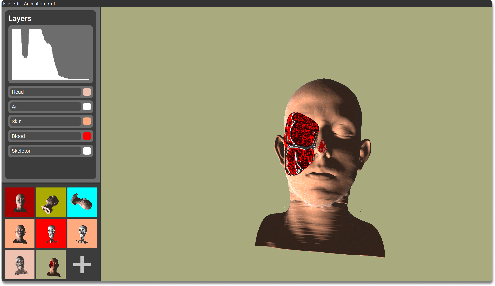

	
	<h1>Strangevis Movie Maker</h1>
	

		<b>A visualization tool for exploring and analyzing volumetric data</b>
	

	 
	 

## Project Tasks
- Design and implement a visualization tool for the exploration and analysis of volumetric data
- Learn how to translate task requirements into a working piece of software 
- Think about the objectives before thinking about the realization 
- Iterate and revise your design in a collaborative manner 
- Have fun while doing it - inspire your colleagues with our ideas and be inspired

## Feature List

### 3D Volume Rendering
The main feature and task of our program was to have the ability to load and render a volumetric model.

### Animation
#### Interpolation

### Histogram

### Layers

### Cutting Tool

### States

### Transfer Function

### Other
#### Volume Screenshot
#### Multithreaded Model Loading

## Project Planning
Before we began implementing the program, we followed the [Five Design Sheet Methodology](http://fds.design/). The methodology starts with a brain storming process where all our ideas are written down on the first design sheet. Extracting the most exciting features from the first sheet, we created three completely different design sheets, where each had its own advantages over the others. The final design sheet was a combination of these, where the most important features from every sheet was selected to be implemented in our project. Our final design looked like this:

# Installation
TODO
# Usage

