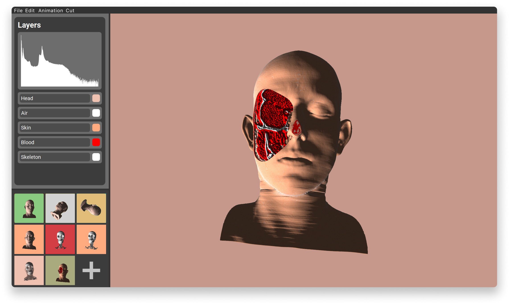
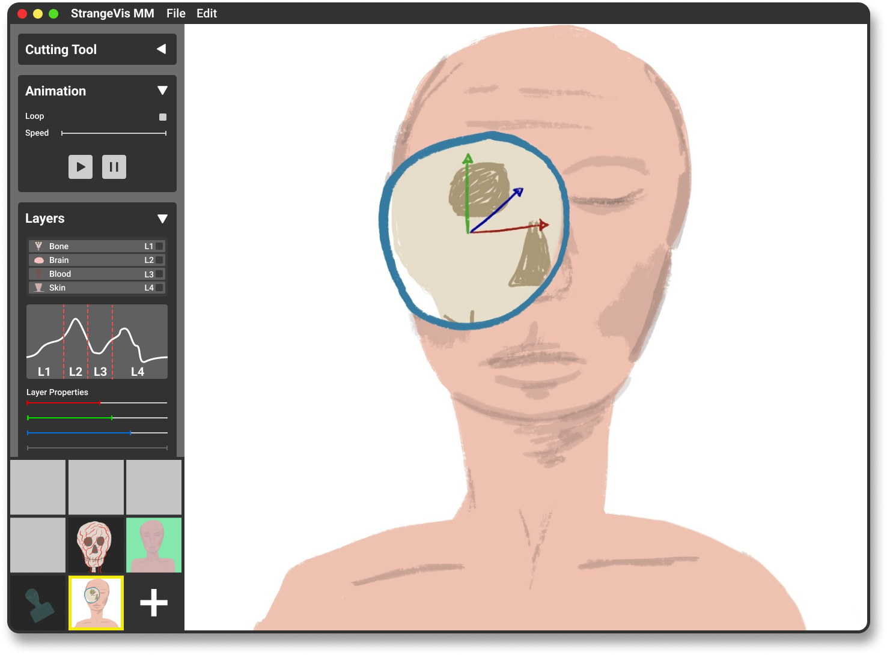
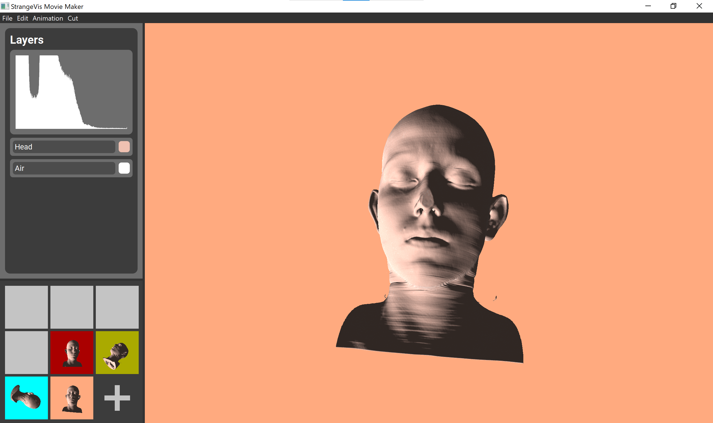
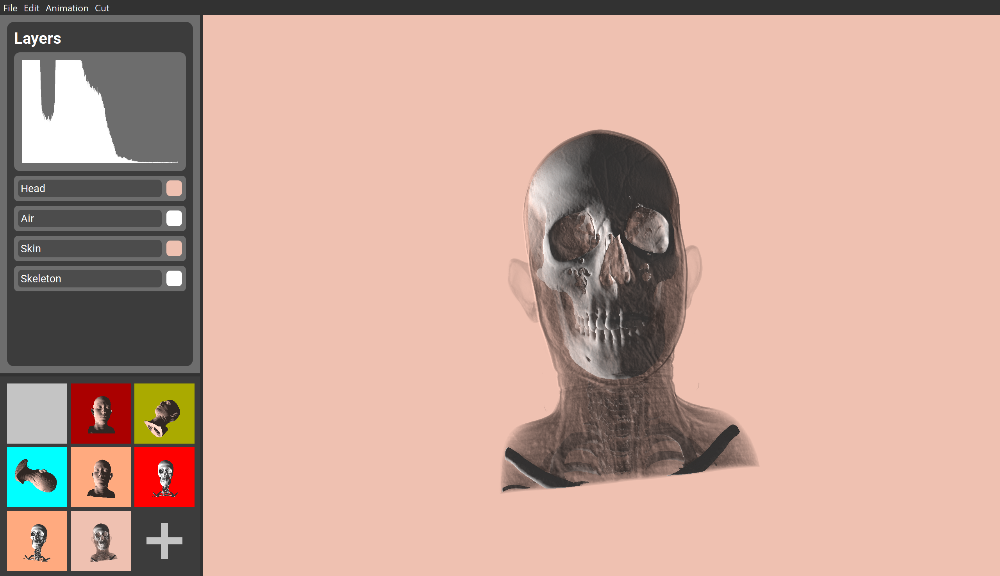
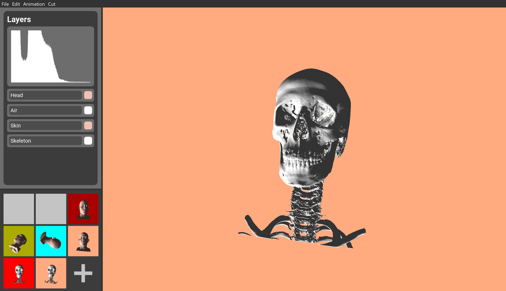

	
	<h1>Strangevis Movie Maker</h1>
	

		<b>A visualization tool for exploring and analyzing volumetric data</b>
	

	 
	 

## Project Tasks

- Design and implement a visualization tool for the exploration and analysis of volumetric data
- Learn how to translate task requirements into a working piece of software
- Think about the objectives before thinking about the realization
- Iterate and revise your design in a collaborative manner
- Have fun while doing it - inspire your colleagues with our ideas and be inspired

## Features

Primary requirements from Dr. Strangevis which our program fulfills:

- T01: I want to see a histogram of all the data values.
- T03: I want to interactively control how colors are assigned to different structures.
- T07: I want to see the 3D surfaces associated with different data values.
- T08: I want to simultaneously see internal and external structures.
- T11: I want to be able to cut open the volume to see its interior.
- T12: I want to select a range of data values and see the resulting 3D structures in relation to the whole volume.

Secondary requirements from Dr. Strangevis which our program fulfills:

- T06: I want to see which structures in the volume contain the highest data values.
- T10: I want to be able to control a virtual light source.
- T16: I want to see a magnified view of a specified region of the volume.
- T17: I want to see multiple different views of the same dataset side-by-side.
- T23: I want to be able to generate realistic images with shadows.
- T25: I want to see an overview of the whole dataset.

Extra features not specified by Dr. Strangevis which our program includes:

- Saving snapshots : users have the ability to save snapshots of the program. These will be saved across program instances letting the user "pick up where they left of" the next time they run the program.
- Animation : users can play an animation that loops through all saved snapshots. This allows the user to explore different parts of the volume without having to explicitly set the different transformations and transfer function mappings. It also allows for nice presentations of the volume models.
- Saving high resolution screenshots : users can choose to save high resolution screen shots of the rendered volume.
- Asynchronous loading : volumetric datasets can be very large and thus take many tens of seconds to load. Therefore we have implemented asynchronous loading of the volumes, allowing the user to continue to interact with the program while the new volume is being loaded in the background.

### 3D Volume Rendering

The main task of our program was to have the ability to load and render a volumetric model.

Our program uses volumetric data from a data file chosen by the user. We assume the file the user chooses follows the specifications in `fileformat.txt`, and that the file `<volumedata>.dat` is accompanied by a metadata file called `<volumedata>.ini` containing information about the spacing of the regular grid of voxels.

This volume is rendered in the main window of our application by direct volume rendering. This is achieved by rendering a screen filling quad in order to shoot a ray through each rendered pixel. The rays are checked for intersection with the bounding box of the volume, if there is no intersection the pixel is set to the color of the background. If there is intersection, the shader steps though the volume along the ray while sampling the volume to check the density at each point. The density is then used to sample the user defined `transfer function`, which maps density values to a RGBA-color vector. If this color vector does not have a very small alpha value (opacity), we estimate the gradient at the point in the volume by central differences. The gradient is used as the normal at the point when calculating the final color contribution of the point to the pixel. We are using the diffuse component of `Phong shading` to achieve a more realistic final result.

If the alpha value is very small, less than 0.0001, we have added a crude `empty space skipping`-inspired optimization. What happens is that we skip along the ray (with a user defined step size) and sample the volume and transfer function at this new point. If the alpha value at this next point is also very small, we then just continue the stepping along the ray from this second point. The reason this crude technique works quite well with our datasets, is that volumetric data generally contains a lot of air around the interesting parts. Usually users will want to set the opacity of the air to `0` since it is generally not of interest. Thus we know that there will usually be many contiguous voxels with opacity `0`, and it is quite likely that we can skip the next "chunck" of the ray.
Obviously, if the step size of the skip is too large this method could end up ignoring parts of the volume that were not intended to be ignored. And if the step size of the skip is too small this method would just introduce extra overhead that could damage performance instead of enhancing it.

When the ray exits the bounding box of the volume, we check if the pixel is completely opaque. `If not (alpha < 1)`, we add the `background color * (1 - alpha)` to the final color. This gives the effect that the volume is transparrent and that the user can see the background through the volume.

As mentioned, the user can specify how the program should map between density values, and color and opacity values. The user can also specify the position, rotation and scale of the volume, and the position and rotation of the light source. In addition the user can set the background color, the step size along the ray, the step size of the skipping, and disable/enable a cut and set the size of this. These actions will be detailed later in the `README.md`.

### Histogram

The histogram is a central part of the application. It is the "man in the middle" when selecting layers, and reflects the density of the volume being rendered. It is generated on volume load, and refreshes if a new volume has been loaded.

We have implemented three different modes for data display in the histogram. The standard mode is the `logarithmic`, where the data is displayed using a logarithmic y-axis.

Another mode is the `linear` mode, which presents the data as it is in the dataset. While this represents the data in the most accurate way, some datasets with densities occuring a lot will make the less occuring densities hard to interpret. Therefore, we have added a final mode for data representation in the histogram, which we have called `linear with clamp`. Here, the user can define the clamp-value, which makes the densities with low occurences much more visible, and moving the focus away from the high-occurence densities.

Doing a <kbd>Click and Drag</kbd> action on the histogram will select the corresponding data in the volume, and a `QColorDialog` will pop-up and give the user the ability to set the color and opacity for this data. This action creates a new `Layer`, which is explained in detail below.

### Layers

When the histogram has been used to create a new layer, this will be given the default name `Layer name...`. The layer label is a `QLineEdit`, and renaming the layers is done by typing into this text field. The layer widget includes a small color sample representing the selected color for the corresponding layer, and pressing this will open the `QColorDialog` again, enabling color and opacity changing.

Each layer stores the bounds of the data selection, color, opacity and the label text of the layer.

To delete a layer, simply <kbd>Double Click</kbd> on the outermost parts of the layer widgets.

### Animation

The `Movie Maker` part of our program hints about presenting the data in a way which might look like a movie. To achieve this, we needed to implement a few key features; `State Saving`, `State Loading` and `Interpolation` for smooth transitions between the states.

#### States

A state can be saved in two different ways; either using the <kbd>K</kbd> key, or using the large <kbd>+</kbd> button in the `Keyframe Handler` in the lower left corner of the screen. A state is then saved to a local folder, and contains information about the `projection`, `rotation`, `scaling`, and `translation` matrices used with the current volume in view, in addition to the `background color`, `transfer function` data and each `layer` used. A low-resolution snapshot is also saved with each state, which together creates the Keyframes the Keyframe Handler is presenting.

A state is loaded on demand, and can be triggered by clicking on a saved Keyframe. This initializes a function which updates the matrices to the corresponding ones included in the state file, and the same goes for the other contents saved in the state. The results of a state read is that the volume looks exactly like the corresponding low-resolution snapshot which was clicked to trigger the state read.

#### Interpolation

Updating the states without interpolating to the new one would not look movie like at all, so we wanted to implement some kind of interpolation to achieve this feeling of smooth animations between two different states. When a state read is initialized, every part of the loaded state will be loaded while being interpolated with a length or step size controlled by the user.

While the interpolation between one state and another looks great using linear interpolation, this would not look equally great when interpolating between several states. To make this kind of interpolation look much better, we also implemented a Catmull-Rom interpolation, making the transitions between many states look much smoother.

The Catmull-Rom interpolation enabled us to interpolate smoothly through all saved states. To start playing through all states, press <kbd>A</kbd>. The type of interpolation can be changed via the menubar, in addition to the option for setting a user specified duration.

### Cutting Tool

Our program contains a very simple cutting tool, which allows the user to see the interior of the rendered volume. The user can choose between a spherical and a cubical cut, and specify the radius or edge length respectively.
The spherical cut is centered in the scene, and remains stationary as the volume is translated, rotated or scaled. This allows the user to examine different parts of the interior of the volume.
The cubical cut is stationary with respect to the volume, meaning that it moves with the volume.

The cut is represented by its position and size, these are sent to the shader where we perform an intersection test with the user specified geometry. The shader then performs the necessary logic to skip over the part of the volume that is inside the cut geometry.

A nice, although incidental, consequence of this very simple cutting tool is that a cut usually increases the performance of the rendering since the rays can skip parts of the volume.

We recognize that our cutting tool has some usability issues and would benefit from a little extra attention. Unfortunately, for this project, we ran out of time. We feel however that the cutting tool does provide more user value than the cost of potential frustration, and so we are leaving it in our finished program.

### Transfer Function

Our transfer function is a `512x1 RGBA` texture that is used by the shader to map between density values and the user specified RGBA values. The user can specify the RGBA values of the transfer function by selecting intervals in the histogram and giving these an RGBA value. The program will then update the associated range in the transfer function to contain this RGBA value, and blend these new values with the existing transfer function based on the user specified blending factor (see <kbd>[Menubar Actions](#menubar-actions)</kbd>-><kbd>Advanced</kbd>-><kbd>Transfer function blending</kbd>).

### Other

#### Volume Screenshot

Under the <kbd>File</kbd> item in the menubar there is an option for creating high resolution screenshots of the `OpenGLWidget`, which is the widget where the volume is being rendered. The screenshots are saved inside a project folder named `screenshots`.

#### Background Coloring

Pressing <kbd>B</kbd> or using the menubar item <kbd>Edit</kbd>-><kbd>Choose Background Color</kbd> will open the `QColorDialog`, which provides the ability for the user to set a custom background color for the `OpenGLWidget`.

#### Multithreaded Volume Loading

To avoid making the application not responding while a new volume is being loaded, we have implemented multithreading for loading on another thread. When the volume loading has completed without errors, it sends a <kbd>signal</kbd> to redraw the histogram and update the keyframes being show in the `Keyframe Handler`. This makes the user experience more seamless, without interrupting the workflow when loading large datasets.

## Project Planning

Before we began implementing the program, we followed the [Five Design Sheet Methodology](http://fds.design/). The methodology starts with a brain storming process where all our ideas were written down on the first design sheet. Extracting the most exciting features from the first sheet, we created three completely different designs, where each had its own advantages over the others. The final design sheet was a combination of these, where the most important features from every design was selected to be implemented in our project. Our final design looked like this:

# Installation

To install the project, simply download the [latest release](https://github.com/rikkeaas/strangevis-moviemaker/releases) which contains the complete source code for the project, in addition to all prebuilt dependencies and binaries for Windows.

# Running

To run the project, un-zip the downloaded folder from the previous step. After this, a folder named `Release` will be created, and this contains the executable file `strangevis-moviemaker.exe`. <kbd>Double Click</kbd> this executable, and the project will start running.

# Usage

`Strangevis Movie Maker` is highly interactive with loads of different features. Here is a list of how to use every single one of them.

## Keyboard Shortcuts and Mouse Actions

- <kbd>A</kbd>: Interpolate through all saved states
- <kbd>B</kbd>: Choose background color for `OpenGLWidget`
- <kbd>C</kbd>: Clear all saved states
- <kbd>K</kbd>: Save state
- <kbd>Shift</kbd><kbd>Click on Keyframe</kbd>: Delete selected keyframe
- <kbd>Shift</kbd><kbd>Mouse Drag</kbd>: Rotate volume
- <kbd>Mouse drag</kbd>: Translate volume
- <kbd>Mouse scroll</kbd>: Scale volume

## Menubar Actions

Items in the <kbd>File</kbd> menu:

- <kbd>Open</kbd>: Open a `QFileDialog` for selecting a volume to load
- <kbd>Screenshot</kbd>: Save a screenshot of the `OpenGLWidget`

Items in the <kbd>Edit</kbd> menu:

- <kbd>Choose Background Color</kbd>: Choose background color for `OpenGLWidget`
- <kbd>Choose histogram Y-axis scaling</kbd>: Choose how the histogram data will be shown
- <kbd>Toggle light/volume transformation</kbd>: Toggle mode for transforming the volume or the light

Items in the <kbd>Animation</kbd> menu:

- <kbd>Play animation</kbd>: Interpolate through all saved states
- <kbd>Set type of interpolation</kbd>: Set the type of interpolation used in the animation
- <kbd>Adjust Animation Duration</kbd>: Set the duration of a single interpolation between two states
- <kbd>Clear All States</kbd>: Clear all saved states

Items in the <kbd>Cut</kbd> menu:

- <kbd>Cut type</kbd>: Choose type of cut
- <kbd>Set cut radius (spherical cut)</kbd>: If spherical cut is selected, set the cut radius
- <kbd>Set cut size (cubical cut)</kbd>: If cubical cut is selected, set the cut size
- <kbd>Visualize cut geometry</kbd>: Draw an object for visualizing how and where the cut is being made

Items in the <kbd>Advanced</kbd> menu:

- <kbd>Transfer function blending</kbd>: This feature lets the user decide how much the different layers that set the RGBA values of transfer function should be blended. Blending in this context means linear interpolation between the current values of the transfer function and the newly specified values of a layer. Setting this value to 0 means that there is no blending, setting it to some value x means that the x values before the layer interval, and the x values after the layer interval will be impacted by the specification of a new layer.
  A higher blending value is associated with better image quality, but it will at the same time make the transfer function harder to control for the user, as a layer does not only impact the density range specified by the user.
- <kbd>Set ray sampling distance multiplier</kbd>: This value is multiplied with the sampling distance in the shader, letting the user trade image quality with better performance and vice versa. This impacts how often the volume is sampled along a ray. A higher value will mean fewer sampling points, and thus better performance. A lower value will mean more sampling points along the ray, and thus better image quality.
- <kbd>Set skipping step size</kbd>: This value decides the length of the step size of our crude "empty space skipping"-inspired optimization. How this works is detailed above in the part about 3D volume rendering.
  A high value here will drastically increase performance, but it can create artifacts in some models. A notable example of such artifacts can be seen in volumes containing heads where a high value can lead to holes in the ears and the nose. To rectify this the value can be set to around 10, although this limits the performance enhancing contribution of this feature.

# Feature Preview

> Linear Interpolation between saved states

# Screenshots

# License

Copyright © 2021, [Rikke Aas](https://github.com/rikkeaas) and [Christian Hein](https://github.com/chrhein). Written as a part of the [INF252](https://vis.uib.no/courses/inf252/) course at the [University of Bergen](https://github.com/uib). Released under the GPLv3 License.
