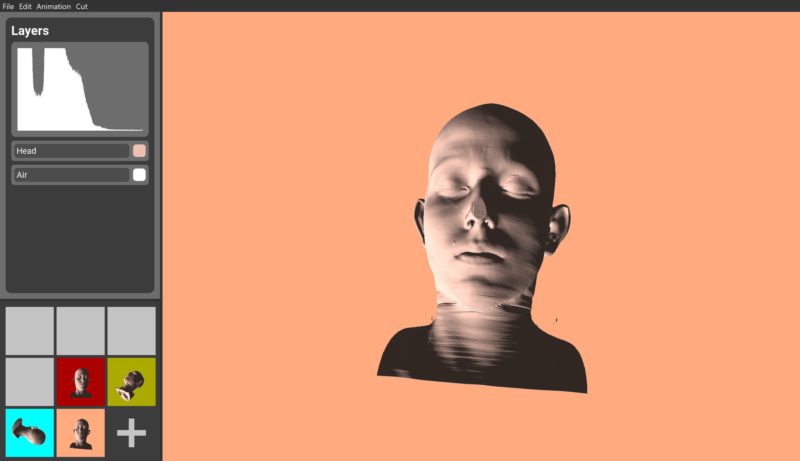

	
	<h1>Strangevis Movie Maker</h1>
	

		<b>A visualization tool for exploring and analyzing volumetric data</b>
	

	 
	 

## Project Tasks

- Design and implement a visualization tool for the exploration and analysis of volumetric data
- Learn how to translate task requirements into a working piece of software
- Think about the objectives before thinking about the realization
- Iterate and revise your design in a collaborative manner
- Have fun while doing it - inspire your colleagues with our ideas and be inspired

## Features

### 3D Volume Rendering

The main task of our program was to have the ability to load and render a volumetric model.

### Animation

The `Movie Maker` part of our program hints about presenting the data in a way which might look like a movie. To achieve this, we needed to implement a few key features; `State Saving`, `State Loading` and `Interpolation` for smooth transitions between the states.

#### States

A state can be saved in two different ways; either using the <kbd>K</kbd> key, or using the large <kbd>+</kbd> button in the `Keyframe Handler` in the lower left corner of the screen. A state is then saved to a local folder, and contains information about the `projection`, `rotation`, `scaling`, and `translation` matrices used with the current model in view, in addition to the `background color`, `transfer function` data and each `layer` used. A low-resolution snapshot is also saved with each state, which together creates the Keyframes the Keyframe Handler is presenting.

A state is loaded on demand, and can be triggered by clicking on a saved Keyframe. This initializes a function which updates the matrices to the corresponding ones included in the state file, and the same goes for the other contents saved in the state. The results of a state read is that the model looks exactly like the corresponding low-res snapshot which was clicked to trigger the state read.

#### Interpolation

Updating the states without interpolating to the new one would not look movie like at all, so we wanted to implement some kind of interpolation to achieve this feeling of smooth animations between two different states. When a state read is initialized, every part of the loaded state will be loaded while being interpolated with a length or step size controlled by the user.

While the interpolation between one state and another looks great using linear interpolation, this would not look equally great when interpolating between several states. To make this kind of interpolation look much better, we also implemented a Catmull-Rom interpolation, making the transitions between many states look much smoother.

The Catmull-Rom interpolation enabled us to interpolate smoothly through all saved states. To start playing through all states, press <kbd>A</kbd>. The type of interpolation can be changed via the menubar, in addition to the option for setting a user specified duration.

### Histogram

### Layers

### Cutting Tool

### Transfer Function

### Other

#### Volume Screenshot

Under the <kbd>File</kbd> item in the menubar there is an option for creating high resolution screenshots of the `OpenGLWidget`, which is the widget where the volume is being rendered. The screenshots are saved inside a project folder named <kbd>screenshots</kbd>.

#### Background Coloring

Pressing <kbd>B</kbd> will open the `QColorDialog`, which provides the ability for the user to set a custom background color for the `OpenGLWidget`.

#### Multithreaded Model Loading

To avoid making the application not responding while a new model is being loaded, we have implemented multithreading for loading the model on another thread. When the model has loaded without errors, it sends a signal to redraw the histogram and update the keyframes being show in the Keyframe Handler. This makes the user experience more seamless, without interrupting the workflow when loading large datasets.

## Project Planning

Before we began implementing the program, we followed the [Five Design Sheet Methodology](http://fds.design/). The methodology starts with a brain storming process where all our ideas were written down on the first design sheet. Extracting the most exciting features from the first sheet, we created three completely different designs, where each had its own advantages over the others. The final design sheet was a combination of these, where the most important features from every design was selected to be implemented in our project. Our final design looked like this:

# Installation

TODO

# Usage

TODO

## Keyboard Shortcuts and Mouse Actions

- <kbd>A</kbd>: Interpolate through all saved states
- <kbd>B</kbd>: Choose background color for `OpenGLWidget`
- <kbd>C</kbd>: Clear all saved states
- <kbd>K</kbd>: Save state
- <kbd>Shift + Click on Keyframe</kbd>: Delete selected keyframe
- <kbd>Shift + Mouse Drag</kbd>: Rotate volume
- <kbd>Mouse drag</kbd>: Translate volume
- <kbd>Mouse scroll</kbd>: Scale volume

## Menubar Actions

<kbd>File</kbd>:

- <kbd>Open</kbd>: Open `QFileDialog` for selecting a model to load
- <kbd>Screenshot</kbd>: Save a screenshot of the `OpenGLWidget`

<kbd>Edit</kbd>:

- <kbd>Choose Background Color</kbd>: Choose background color for `OpenGLWidget
- <kbd>Set ray sampling distance multiplier</kbd>: TODO
- <kbd>Toggle light/volume transformation</kbd>: Toggle mode for transforming the volume or the light

<kbd>Animation</kbd>:

- <kbd>Set type of interpolation</kbd>: Set the type of interpolation used in the animation
- <kbd>Adjust Animation Duration</kbd>: Set the duration of a single interpolation between two states
- <kbd>Clear all states</kbd>: Clear all saved states

<kbd>Cut</kbd>:

- <kbd>Cut type</kbd>: Choose type of cut
- <kbd>Set cut radius (spherical cut)</kbd>: If spherical cut is selected, set the cut radius
- <kbd>Set cut size (cubical cut)</kbd>: If cubical cut is selected, set the cut size
- <kbd>Visualize cut geometry</kbd>: Draw an object for visualizing how and where the cut is being made

# Screenshots

